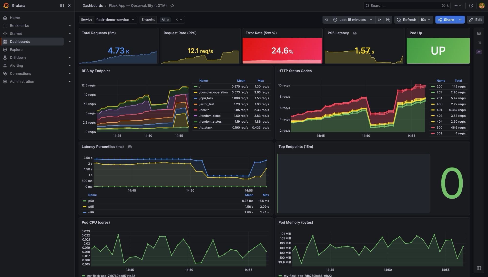
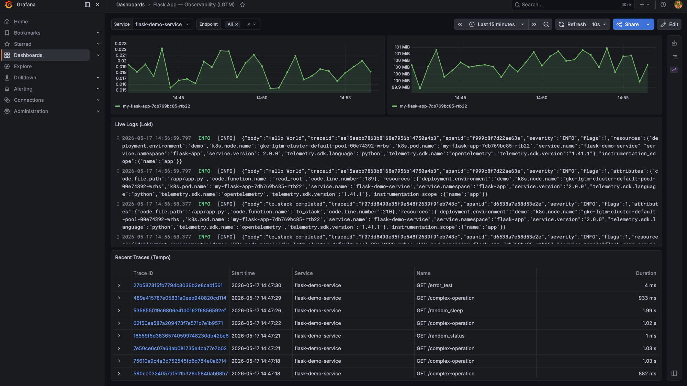
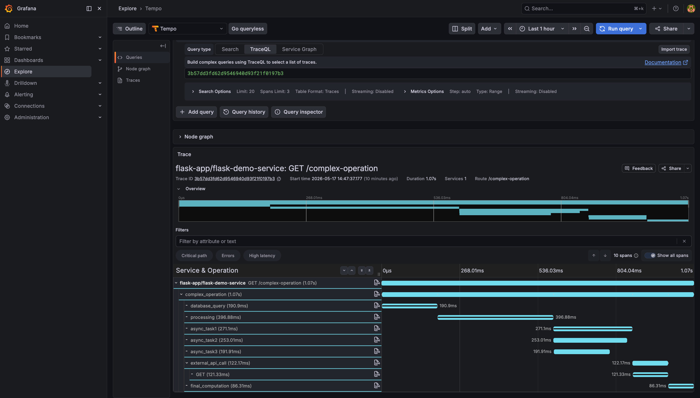
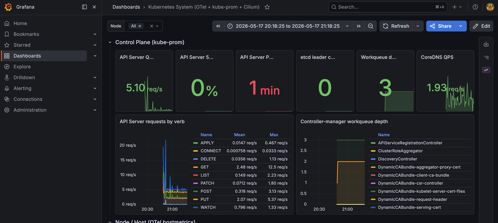
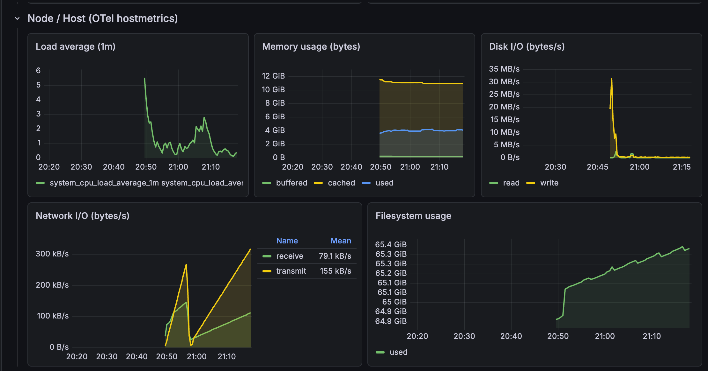
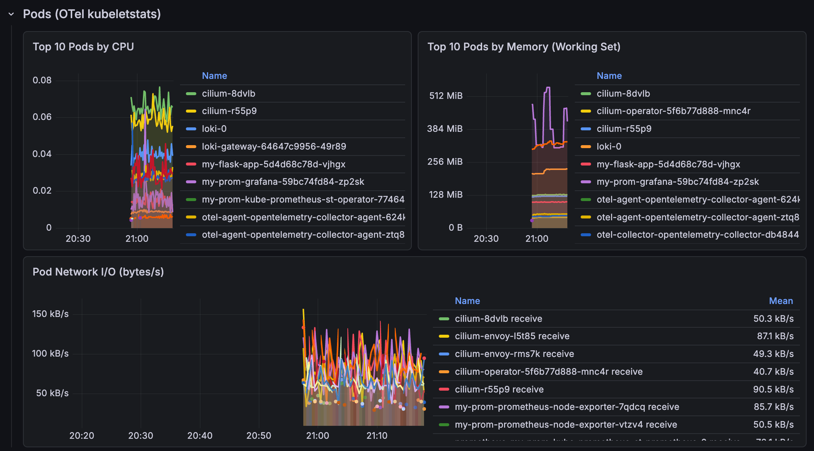
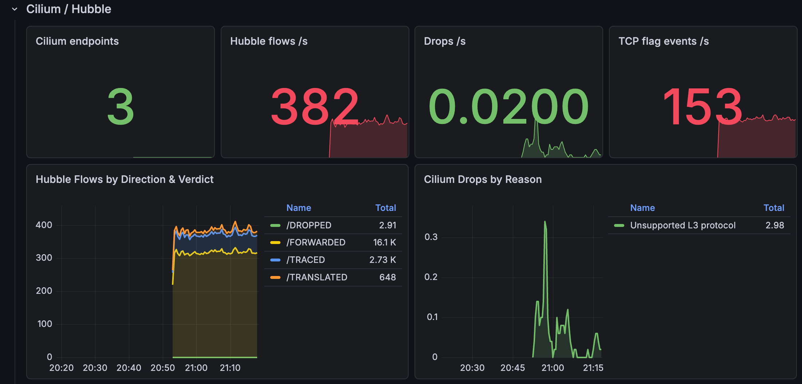
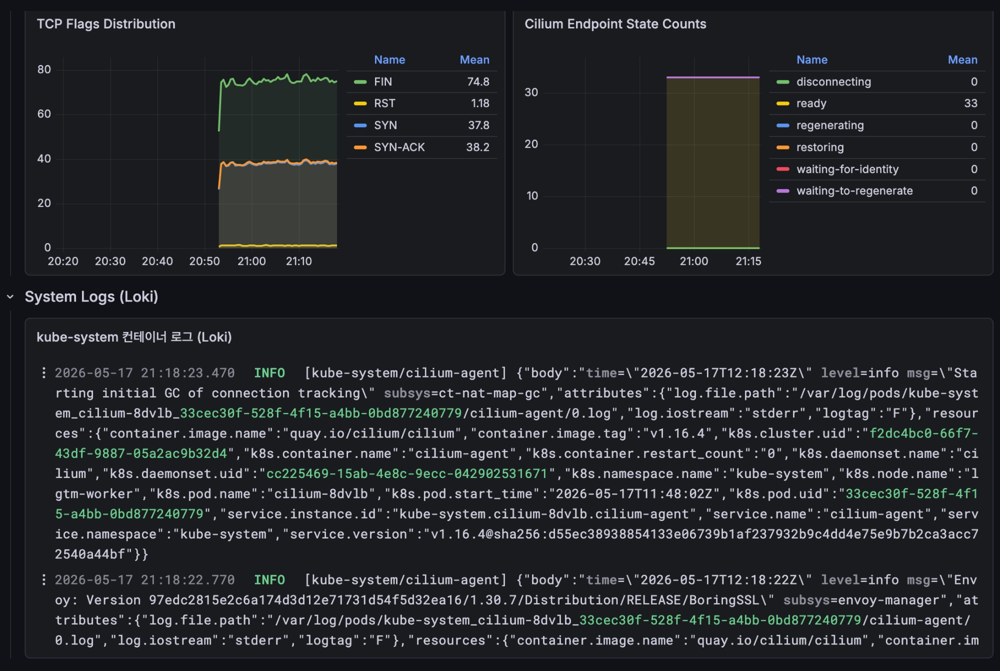

# lgtm-stack-with-helm

> Kubernetes(**GKE 또는 kind**) + OpenTelemetry Collector + **LGTM 스택**(Loki·Grafana·Tempo·Prometheus) + 선택적 **Cilium**(eBPF CNI + Hubble L4-L7 관측성)을 **한 줄 명령으로** 배포하는 통합 관측성(Observability) 실습 환경.



> 📸 [실행 결과 스크린샷 더 보기 ↓](#-실행-결과-스크린샷) — 대시보드 / 로그 / 트레이스

---

## 한눈에 보기

| 영역 | 도구 | 포트/엔드포인트 |
|---|---|---|
| **메트릭** | Prometheus (kube-prometheus-stack) | `:9090` (in-cluster) |
| **로그**   | Loki (SingleBinary) | `:3100` / gateway `:80` |
| **트레이스** | Tempo (distributed) | `:3200` / OTLP `:4317` |
| **시각화** | Grafana | LoadBalancer `:80` |
| **수집기 (앱)** | OpenTelemetry Collector (Deployment) | OTLP `:4317`/`:4318` |
| **수집기 (노드)** | OpenTelemetry Collector (DaemonSet) | filelog + hostmetrics + kubeletstats |
| **CNI** (옵션) | Cilium 1.16 + Hubble | kubeProxyReplacement, eBPF flows |
| **LB** (kind 한정) | MetalLB | L2 advertisement |
| **데모 앱** | Flask + OTel SDK | LoadBalancer `:80` → `:5000` |

---

## 아키텍처

```
   ┌──────────────┐         ┌───────────────────────┐
   │  Flask App   │  OTLP   │ OpenTelemetry         │
   │  + OTel SDK  │ ──────▶ │ Collector (deployment)│
   │  (logs/      │  :4317  │                       │
   │   metrics/   │         │  pipelines:           │
   │   traces)    │         │   logs    → Loki      │
   └──────────────┘         │   metrics → Prometheus│
          ▲                 │   traces  → Tempo     │
          │ traffic_gen.sh  └─────────┬─────────────┘
          │                           │
   ┌──────┴─────────────┐             ▼
   │ LoadBalancer (k8s) │     ┌──────────────────────┐
   └────────────────────┘     │   Loki  Tempo  Prom  │
                              │       └─┬──┘         │
                              │         ▼            │
                              │      Grafana ◀── LB  │ ← 사용자 브라우저
                              │     (자동 등록된      │
                              │      DataSources +   │
                              │      대시보드)        │
                              └──────────────────────┘
```

**핵심 흐름**: 앱의 신호(log/metric/trace) → OTel Collector → 백엔드 분기 → Grafana에서 단일 화면으로 조회.

---

## 사전 요구사항

| 필수 | 용도 |
|---|---|
| `gcloud` (인증 완료) | GKE 자동 생성 옵션 사용 시 |
| `kubectl` ≥ 1.28 | k8s 리소스 적용 |
| `helm` ≥ 3.14 | 차트 설치 |
| `jq` | 스크립트 보조 |
| `bash` ≥ 4 | 스크립트 실행 |

> `CREATE_GKE=1` 옵션을 안 쓰면 이미 접근 가능한 어떤 쿠버네티스 클러스터든 OK (kind/minikube/EKS 등).

---

## 한 줄 배포

```bash
# A. GKE 자동 생성 (gcloud fsi* 프로젝트 자동 선택)
CREATE_GKE=1 bash deploy.sh

# B. kind 클러스터 + metallb + (선택) cilium
USE_KIND=1 bash deploy.sh                        # 기본 CNI(kindnet) + kube-proxy
USE_KIND=1 WITH_CILIUM=1 bash deploy.sh          # Cilium eBPF + Hubble + kube-proxy 대체

# C. 이미 있는 클러스터에 배포
bash deploy.sh

# D. 명령어만 출력 (안전 점검)
DRY_RUN=1 bash deploy.sh
```

| 환경 변수 | 효과 | 추가되는 단계 |
|---|---|---|
| `CREATE_GKE=1` | GCP에 `lgtm-cluster` 신규 생성 | `create-gke.sh` |
| `USE_KIND=1` | 로컬 docker에 kind 클러스터 생성 | `create-kind.sh`, `01b-metallb.sh`, `03b-otel-agent.sh` |
| `WITH_CILIUM=1` | Cilium CNI + Hubble L4-L7 메트릭 | `01c-cilium.sh`, `02b-cilium-metrics.sh`, kube-prom의 kube-proxy ServiceMonitor 비활성화 |
| `DRY_RUN=1` | 모든 명령 echo만 |  |

배포가 끝나면 마지막에 외부 IP가 출력됩니다:

```
════════════════════════════════════════════════════════
  배포 완료
════════════════════════════════════════════════════════
  Grafana   : http://34.132.168.28   (admin / Test1234)
  대시보드  : http://34.132.168.28/d/flask-app-observability
  Flask App : http://34.173.116.177
════════════════════════════════════════════════════════
```

---

## 환경 변수

| 변수 | 기본값 | 설명 |
|---|---|---|
| `CREATE_GKE` | `0` | `1`이면 GKE 클러스터를 먼저 생성 |
| `GKE_CLUSTER` | `lgtm-cluster` | (create-gke.sh 인자) |
| `GKE_ZONE` | `us-central1-a` | (create-gke.sh 인자) |
| `TEMPO_CHART_VERSION` | `2.26.2` | Kafka 없는 분산 구성을 유지하는 최신 Tempo 2.x 차트 |
| `DRY_RUN` | `0` | `1`이면 실제 실행 없이 명령만 출력 |

> `tempo-distributed` 3.x(Tempo 3.0)는 분산 모드의 쓰기 경로에 Kafka가 필수입니다.
> 이 실습 환경은 별도 Kafka를 배포하지 않으므로 `2.26.2`(Tempo 2.10.7)를 기본값으로 고정합니다.
> Tempo 3.x로 올리려면 Kafka와 공유 객체 스토리지를 먼저 구성한 뒤
> `ingest.kafka.address`, `blockBuilder`, `liveStore`를 함께 마이그레이션해야 합니다.

---

## 📸 실행 결과 (스크린샷)

배포 직후 트래픽 제너레이터가 8개 엔드포인트로 무작위 요청을 보내면, **Grafana 한 화면에서 메트릭·로그·트레이스가 동시에** 흐릅니다.

### 1. 대시보드 상단 — KPI + 시계열


화면에서 확인 가능한 항목:

| 패널 | 실제 캡처 예시 |
|---|---|
| **Total Requests (5m)** | `4.73K` |
| **Request Rate (RPS)** | `12.1 req/s` |
| **Error Rate (5xx %)** | `24.6 %` (배경색 임계치 빨강) |
| **P95 Latency** | `1.57 s` |
| **Pod Up** | `UP` (녹색) |
| **RPS by Endpoint** | `/`, `/complex-operation`, `/cpu_task`, `/error_test`, `/health`, `/random_sleep`, `/random_status`, `/to_stack` 별 RPS stacked |
| **HTTP Status Codes** | `200`, `201`, `204`, `400`, `401`, `403`, `404`, `500`, `502` 색상 구분(2xx 녹·4xx 노·5xx 빨) |
| **Latency Percentiles** | p50 / p95 / p99 |

### 2. 대시보드 하단 — 리소스 + Logs + Traces



- **Pod CPU / Memory** — kube-state-metrics + cAdvisor 기반
- **Live Logs (Loki)** — `{service_name=~".+/flask-demo-service|flask-demo-service"} | json` 로 파싱된 실시간 로그 스트림 (트레이스 ID·level·resource 속성 모두 함께)
- **Recent Traces (Tempo)** — Trace ID · Start time · Service · Name · Duration. **Trace ID 클릭 → 트레이스 상세로 점프** (data link)

### 3. 트레이스 상세 — `/complex-operation`



`/complex-operation` 한 번의 요청이 만든 **10 spans, 1.07s** 트리:

```
flask-app/flask-demo-service: GET /complex-operation (1.07s)
└─ complex_operation (1.07s)
   ├─ database_query     (190.9 ms)
   ├─ processing         (396.88 ms)
   ├─ async_task1        (271.10 ms)   ┐
   ├─ async_task2        (253.01 ms)   ├─ asyncio.gather (병렬)
   ├─ async_task3        (191.91 ms)   ┘
   ├─ external_api_call  (122.17 ms)
   │  └─ GET (requests)  (121.33 ms)
   └─ final_computation  ( 86.31 ms)
```

병렬 실행(`asyncio.gather`), 외부 API 호출(`RequestsInstrumentor` 자동 child span), 동기/비동기 혼합 패턴이 한 트레이스에서 모두 시각화됩니다.

### 스크린샷 파일 추가하기

위 이미지 참조는 `docs/screenshots/` 폴더에 같은 이름으로 PNG를 두면 자동으로 렌더링됩니다:
```
docs/screenshots/
├── 01-dashboard-top.png
├── 02-dashboard-bottom.png
└── 03-trace-detail.png
```

---

## 미리 만들어둔 Grafana 대시보드 (2개)

ConfigMap 라벨 `grafana_dashboard=1` 로 Grafana sidecar가 자동 로드.

### 1. Flask App — Observability (LGTM) — `/d/flask-app-observability`

- 상단 KPI: Total Requests · RPS · 5xx Error Rate · P95 Latency · Pod Up
- RPS by Endpoint / HTTP Status (2xx/4xx/5xx 색상) / P50·95·99 Latency / Top Endpoints
- Pod CPU·Memory
- **Loki 라이브 로그** — `json | line_format` 으로 `[LEVEL] (logger) msg trace_id=...`
- **Tempo 최근 트레이스** — traceqlSearch + traceID 클릭으로 상세 점프

변수: `$service`, `$endpoint`

### 2. Kubernetes System (OTel + kube-prom + Cilium) — `/d/k8s-system-otel`

5개 row, 24개 패널로 클러스터 시스템 컴포넌트를 통합. **kube-proxy 자리는 Cilium**이 대체(kubeProxyReplacement=true), **노드 신호는 OTel DaemonSet**, **로그는 OTel filelog → Loki**.

변수: `$node` (host_name, multi)

---

#### Row 1 — Control Plane (kube-prom)



API Server / etcd / Controller-manager / Scheduler / CoreDNS의 핵심 KPI를 한눈에. 실측 캡처:

| KPI | 값 |
|---|---|
| API Server QPS | `5.10 req/s` |
| API Server 5xx % | `0 %` |
| API Server P99 | `1 min` (느린 watch 포함) |
| etcd leader changes (5m) | `0` |
| Workqueue depth (max) | `3` |
| CoreDNS QPS | `1.93 req/s` |

하단 시계열: **API Server requests by verb** (APPLY/GET/PUT/PATCH/POST/WATCH 등 verb별 RPS) + **Controller-manager workqueue depth** (`APIServiceRegistrationController`, `DynamicCABundle-*` 등 내부 컨트롤러별 큐 깊이).

---

#### Row 2 — Node / Host (OTel hostmetrics, DaemonSet)



`system_cpu_load_average_*`, `system_memory_usage_bytes`, `system_disk_io_bytes_total`, `system_network_io_bytes_total`, `system_filesystem_usage_bytes` — 모두 **OTel hostmetrics** receiver가 노드별로 수집.

- **Load 1m**: 클러스터 부팅 직후 5.5까지 치솟았다가 ~0.3 안정화
- **Memory**: cached 11 GiB / used ~4 GiB
- **Disk I/O**: 이미지 풀 시점 30 MB/s 스파이크 후 거의 0
- **Network I/O**: receive 79 kB/s · transmit 155 kB/s (Mean)
- **Filesystem**: 64.9 GiB → 65.3 GiB로 점진 증가 (스크랩 로그·메트릭 누적)

---

#### Row 3 — Pods (OTel kubeletstats, DaemonSet)



`k8s_pod_cpu_usage`, `k8s_pod_memory_working_set_bytes`, `k8s_pod_network_io_bytes_total` — kubelet의 `/stats/summary` 를 OTel kubeletstats receiver가 폴링.

- **Top10 CPU**: `cilium-8dvlb`, `cilium-r55p9`, `loki-0`, `loki-gateway`, `my-flask-app`, `my-prom-grafana`, OTel agents 등
- **Top10 Memory (Working Set)**: `cilium-operator` 가장 높음 (~512 MiB), `cilium-r55p9`/`8dvlb`, `loki-0`, `my-prom-grafana`, `my-flask-app`
- **Pod Network I/O**: cilium pod들의 receive가 50-90 kB/s (eBPF 데이터플레인 트래픽)

---

#### Row 4 — Cilium / Hubble (KPI + Flows + Drops)



eBPF 기반 네트워킹 가시성:

| KPI | 값 |
|---|---|
| Cilium endpoints (ready) | `3` |
| **Hubble flows /s** | `382` |
| Drops /s | `0.02` |
| TCP flag events /s | `153` |

- **Hubble Flows by Direction & Verdict**: FORWARDED 16.1K / TRACED 2.73K / TRANSLATED 648 / DROPPED 2.91 — 정상 트래픽 비율이 압도적
- **Cilium Drops by Reason**: `Unsupported L3 protocol` 만 2.98 (IPv6 RA 등 무해)

---

#### Row 5 — Cilium 상태 + System Logs (Loki)



- **TCP Flags Distribution**: FIN 74.8 / SYN-ACK 38.2 / SYN 37.8 / RST 1.18 — RST이 적어 연결 종료가 정상
- **Cilium Endpoint State Counts**: `ready: 33` 만 (disconnecting/regenerating/restoring 모두 0)
- **kube-system 컨테이너 로그 (Loki)**: OTel agent의 filelog receiver가 `/var/log/pods/...`를 수집해 Loki로 전송. `cilium-agent`, `cilium-envoy` 등 시스템 컴포넌트 로그가 실시간으로 흐름. 라벨: `service_name="kube-system/<svc>"`, 매칭 쿼리는 `{service_name=~"kube-system/.+"}`

---

## 디렉터리 구조

```
.
├── deploy.sh                # ⭐ 한 줄 배포 진입점
├── cleanup.sh               # 한 줄 정리
├── init.sh                  # 하네스 초기화 래퍼
├── README.md
│
├── scripts/                 # 배포 단계별 스크립트
│   ├── create-gke.sh        # GKE 클러스터 생성 (CREATE_GKE=1)
│   ├── create-kind.sh       # kind 클러스터 생성 (USE_KIND=1)
│   ├── 00-prereq.sh         # 도구 확인
│   ├── 01-repos.sh          # helm repo + 네임스페이스
│   ├── 01b-metallb.sh       # MetalLB (USE_KIND=1, LB 지원)
│   ├── 01c-cilium.sh        # Cilium 1단계 — CNI/Hubble (WITH_CILIUM=1)
│   ├── 02-lgtm.sh           # Loki + Tempo + kube-prometheus-stack
│   ├── 02b-cilium-metrics.sh # Cilium 2단계 — ServiceMonitor (LGTM CRD 후)
│   ├── 03-otel.sh           # OTel Collector (Deployment, 앱 신호 수집)
│   ├── 03b-otel-agent.sh    # OTel Collector (DaemonSet, 노드 신호) — USE_KIND=1
│   ├── 04-datasources.sh    # Grafana DataSource + Dashboard ConfigMap
│   ├── 05-flask-app.sh      # Flask 앱
│   ├── 06-traffic.sh        # 트래픽 제너레이터(백그라운드)
│   └── traffic_gen.sh       # 트래픽 루프 본체
│
├── kind/                    # kind 클러스터 정의
│   ├── cluster.yaml         # 기본 (kindnet + kube-proxy)
│   └── cluster-cilium.yaml  # disableDefaultCNI + kubeProxyMode none
│
├── values/                  # Helm values (모든 --set 인자를 파일로)
│   ├── loki-values.yaml
│   ├── tempo-values.yaml
│   ├── kube-prom-values.yaml      # 공통 (sidecar enable 등)
│   ├── kube-prom-values.kind.yaml # kind 전용 (cp 메트릭 활성화)
│   ├── otel-values.yaml           # OTel Deployment (앱 신호)
│   └── otel-agent-values.yaml     # OTel DaemonSet (노드 신호)
│
├── manifests/
│   ├── flask-app.yaml             # ns + deployment + LoadBalancer + probes
│   ├── grafana-datasources.yaml   # sidecar 자동 로드 (Loki/Tempo)
│   ├── flask-dashboard.yaml       # 앱 대시보드
│   └── k8s-system-dashboard.yaml  # K8s 시스템 대시보드
│
├── flask-app/               # OTel-instrumented 데모 앱 소스
│   ├── app.py
│   ├── requirements.txt
│   ├── Dockerfile
│   └── .dockerignore
│
├── tests/e2e/               # feature 단위 + 통합 E2E 테스트
│   ├── test_feat-001.sh ... test_feat-008.sh
│   └── test_full.sh         # 통합 진입점
│
├── feature-list.json        # 하네스 진척 추적
└── claude-progress.txt      # 세션 로그 (.gitignore됨)
```

---

## 컴포넌트별 설명

### 1. LGTM 백엔드
| 컴포넌트 | 차트 | values |
|---|---|---|
| Loki (SingleBinary, 파일시스템) | `grafana/loki` | `values/loki-values.yaml` |
| Tempo (distributed) | `grafana-community/tempo-distributed` | `values/tempo-values.yaml` |
| Prometheus + Grafana | `prometheus-community/kube-prometheus-stack` | `values/kube-prom-values.yaml` |

`kube-prom-values.yaml`에는 **Grafana sidecar 활성화**가 들어 있어, label만 붙은 ConfigMap을 자동으로 DataSource·Dashboard로 로드합니다:
```yaml
grafana:
  sidecar:
    datasources: { enabled: true, label: grafana_datasource }
    dashboards:  { enabled: true, label: grafana_dashboard  }
```

### 2. OpenTelemetry Collector
`values/otel-values.yaml`에서 receiver/exporter/pipeline을 분리:
- `receivers: otlp` (gRPC :4317, HTTP :4318)
- `exporters`:
  - `loki` → `http://loki-gateway.monitoring:80/loki/api/v1/push`
  - `prometheusremotewrite` → kube-prometheus-stack의 remote-write
  - `otlp/tempo` → `tempo-distributor.monitoring:4317`
- pipelines: logs / metrics / traces 세 갈래 독립

### 3. Flask 데모 앱 (`flask-app/`)
원본 `gasbugs/lgtm-k8s/flask-app` 대비 개선:
- 중복 import 정리, `/to_stack` 신규(원본은 traffic_gen이 호출하지만 정의 없음)
- `/random_status`가 실제로 무작위 2xx/4xx/5xx 반환
- `/error_test`에서 `span.record_exception` + `Status(ERROR)` 기록
- 모든 엔드포인트에 `before/after_request` 훅으로 duration·in-flight·counter 자동 기록
- `LOG_JSON=1`이면 JSON 구조화 로그, SIGTERM에서 BatchProcessor flush
- resource attr 확장(`service.version`, `deployment.environment`, `k8s.pod.name`, `k8s.node.name`)
- **gunicorn**(2 workers × 4 threads), non-root user, HEALTHCHECK
- 외부 API 호출 타임아웃 + graceful fallback + span 속성 기록

### 4. 트래픽 제너레이터
`scripts/traffic_gen.sh` — 1초 간격으로 8개 엔드포인트에 무작위 요청.
`scripts/06-traffic.sh` — 배포 직후 백그라운드로 자동 실행 (PID 파일 + 로그 파일).

```bash
# 수동 실행
bash scripts/traffic_gen.sh http://<FLASK-IP>

# 중단
bash scripts/06-traffic.sh stop
```

---

## 컨테이너 이미지

`docker.io/gasbugs21c/my-flask-app:lgtm-v2` — **멀티아키**(linux/amd64, linux/arm64)

소스를 수정한 뒤 다시 빌드/푸시(podman 사용):
```bash
IMG=docker.io/gasbugs21c/my-flask-app:lgtm-v2

podman manifest rm "$IMG" 2>/dev/null || true
podman manifest create "$IMG"
podman build --platform=linux/amd64,linux/arm64 --manifest "$IMG" flask-app/
podman manifest push --all "$IMG" "docker://$IMG"
```

---

## 정리

앱·LGTM·OTel 삭제 (클러스터와 네트워킹 애드온은 유지):
```bash
bash cleanup.sh                   # 기본
bash cleanup.sh --keep-ns         # 네임스페이스 보존
bash cleanup.sh --kind-addons     # kind 전용 Cilium·MetalLB도 함께 삭제
```

클러스터까지 통째로:
```bash
bash cleanup.sh --delete-kind     # kind: kubectl 단계 건너뛰고 클러스터 삭제
gcloud container clusters delete lgtm-cluster --zone=us-central1-a --project=<fsi-project>   # GKE
```

---

## 테스트 / 검증

오프라인 E2E (실제 클러스터 없어도 통과 — helm template 렌더링·YAML 구조·DRY_RUN 검증):
```bash
bash tests/e2e/test_full.sh
```

기대 출력:
```
요약: PASS 8개, FAIL 0개
==== ALL TESTS PASS ====
```

개별 feature 테스트:
```bash
bash tests/e2e/test_feat-002.sh   # LGTM values 렌더링
bash tests/e2e/test_feat-007.sh   # deploy.sh 오케스트레이터
```

---

## 트러블슈팅

### Grafana에서 로그/트레이스가 안 보임
1. `kubectl -n flask-app get pod` → Running 인지
2. `kubectl -n otel logs -l app.kubernetes.io/name=opentelemetry-collector` → error/warn 반복 없는지
3. Grafana → Explore → DataSource `Loki` 선택 → `{service_name=~".+/flask-demo-service|flask-demo-service"}` 실행
   - OTel loki exporter는 `service.namespace` + `service.name`을 합쳐 `flask-app/flask-demo-service` 형태로 라벨링하므로 정규식 매칭 필요
4. Tempo → Explore → TraceQL `{ resource.service.name="flask-demo-service" }`

### Loki DataSource UID가 랜덤
- 두 번째 이후 배포에서 `04-datasources.sh`가 자동 복구합니다 (잘못된 UID 삭제 후 sidecar 재생성).
- 수동 복구: `curl -u admin:Test1234 -X DELETE http://<GRAFANA-IP>/api/datasources/uid/<RANDOM_UID>`

### Flask 앱이 OTel Collector를 못 찾음
- `OTEL_EXPORTER_OTLP_ENDPOINT`가 `http://otel-collector-opentelemetry-collector.otel.svc.cluster.local:4317` 인지 확인
- Collector 서비스: `kubectl -n otel get svc`

### LoadBalancer EXTERNAL-IP가 `<pending>`
- GCP 외 환경에서 LB Controller가 없을 수 있음. kind는 `USE_KIND=1`이면 MetalLB가 자동으로 docker network 대역(예 `172.18.255.200-250`) IP를 할당.
- 그래도 안 되면 `port-forward`로 우회: `kubectl -n monitoring port-forward svc/my-prom-grafana 3000:80`

### kind에서 MetalLB IPAddressPool 생성 실패 (`invalid CIDR`)
- docker network에 IPv4와 IPv6가 둘 다 있을 때 IPv6를 잘못 골라서 발생.
- `01b-metallb.sh`는 `grep -v ':'` 로 IPv4만 필터함. 직접 만들 때도 같은 패턴 사용.

### kind 환경에서 OTel kubeletstats가 `x509: cannot validate certificate`
- kind kubelet은 self-signed cert → `values/otel-agent-values.yaml`의 `kubeletstats` receiver에 `insecure_skip_verify: true` 명시되어 있음.

### kind 환경에서 컨트롤 플레인 메트릭이 안 보임
- 기본 kind는 controller-manager/scheduler/etcd가 `127.0.0.1` 바인딩 → `ServiceMonitor`가 스크랩 불가.
- `kind/cluster.yaml` 의 `kubeadmConfigPatches`로 `bind-address: 0.0.0.0`, etcd `listen-metrics-urls: http://0.0.0.0:2381` 강제.

### Cilium ServiceMonitor가 Prometheus 타겟으로 안 잡힘
- kube-prometheus-stack 기본 selector는 `release` 라벨만 매칭 → 외부 차트(cilium 등)의 ServiceMonitor 무시.
- `values/kube-prom-values.kind.yaml`의 `serviceMonitorSelectorNilUsesHelmValues: false` + 빈 selector로 모든 ServiceMonitor 픽업.

### Cilium 설치 시 `ServiceMonitor CRD 없음` 오류
- cilium chart는 install 시 CRD를 검증. LGTM(prometheus-operator)이 cilium 이후라 CRD가 없음.
- 본 프로젝트는 cilium을 2단계로 분리: `01c-cilium.sh`(CNI만) → `02b-cilium-metrics.sh`(LGTM 뒤 ServiceMonitor 활성화).

### MetalLB IP는 docker network 내부 — VM 밖에서 접근하려면
docker bridge 대역(`172.18.x.x`)은 호스트(VM) 안에서만 라우팅됨. VM의 public IP에서 접근하려면 `socat`으로 포트 노출:
```bash
sudo systemd-run --unit=socat-grafana socat TCP4-LISTEN:80,fork,reuseaddr   TCP:172.18.255.200:80
sudo systemd-run --unit=socat-flask    socat TCP4-LISTEN:8080,fork,reuseaddr TCP:172.18.255.201:80
```
방화벽 규칙은 별도로 80/8080 열어야 함.

---

## 라이선스 / 출처

- 원본 강의: `https://github.com/gasbugs/lgtm-k8s` (아카이브)
- LGTM 스택: Grafana Labs 공식 차트
- OpenTelemetry: CNCF 프로젝트
